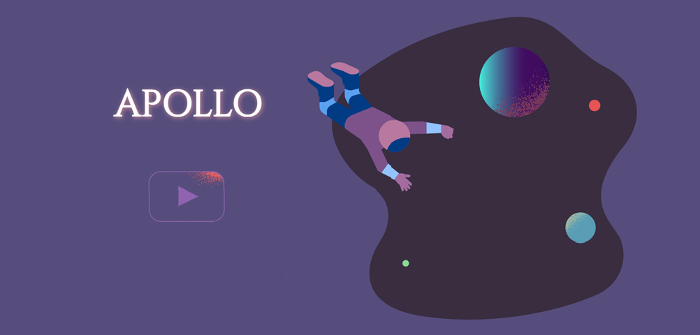

# Apollo


Welcome to "Apollo," a space-themed game where you control a powerful spacecraft that can repel the dangerous Erebus using its groundbreaking technology. The Erebus is a black hole that is slowly consuming the solar system, and it is up to you to save the day.

## How to play the game

In this game, you will use the left and right arrow keys or "A" and "D" keys on your keyboard to control the spacecraft and orbit it around the sun while using its wings to push the Erebus away. As the Erebus collides with the sun, its energy weakens, and it becomes darker until it eventually runs out of energy. However, the game is challenging as the track is covered in 3 shield layers, which leaves little room for errors. Your objective is to protect the solar system by repelling the Erebus, so try your best to maneuver the spacecraft through the track and save the day!

For more information, please read through the [booklet](https://focs.ji.sjtu.edu.cn/silverfocs/demo/2021/p1team4/doc/booklet.pdf).

## Getting Started

The game is available [online](https://focs.ji.sjtu.edu.cn/silverfocs/demo/2021/p1team4/). You can also run the game locally by following the instructions below.

To run the project, you will need to have Elm installed on your system. You can install it by following the instructions on the official Elm website: https://guide.elm-lang.org/install/elm.html

1. Clone the repository

2. Compile the project:

```
elm make src/main.elm
```

3. Run the HTML file generated by the compiler

## Awards

- **Best Artwork Design** - [SIlverFOCS](https://focs.ji.sjtu.edu.cn/silverfocs/famewall/)

## Contributors

**Ocean Cat Studio**


Team member:

- Joven Laurens Nicholas
- TingTing Ding 丁婷婷
- Xu He 何煦
- YueWen Hou 侯悦文
